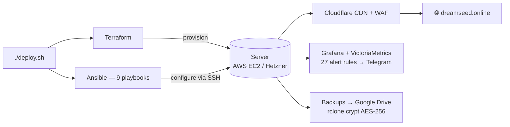

# 🌱 DreamSeed


[](https://status.dreamseed.online)


> **Production infrastructure powering a global social experiment — `dreamseed.online`**
> Built by the Co-founder & CTO. From empty cloud accounts to a monitored, hardened, multi-cloud platform with tested disaster recovery. Single command, ~8–10 min.
>
> 📖 **Documentation**: [Wiki](https://github.com/W1ckedS1ck/DreamSeed/wiki) — architecture, runbook, operations guide, and more
> 📐 **Decisions**: [ADRs](docs/adr/README.md) — the "why" behind the infrastructure · 🔒 [Security policy](.github/SECURITY.md)
>
> 🗓 Continuously updated — see [Releases](https://github.com/W1ckedS1ck/DreamSeed/releases) for the changelog

---

## 📑 Table of Contents

- [About the Product](#about-the-product)
- [Quick Start](#quick-start)
- [By the Numbers](#by-the-numbers)
- [Global Observability](#-global-observability)
- [My Role](#my-role)
- [Tech Stack](#tech-stack)
- [Architecture at a Glance](#architecture-at-a-glance)
- [Deploy Commands](#deploy-commands)
- [Project Layout](#project-layout)
- [Infrastructure Highlights](#infrastructure-highlights)
- [Key Engineering Decisions](#key-engineering-decisions)
- [Live Environments](#live-environments)

---

## 🌍 About the Product {#about-the-product}

**DreamSeed** ([dreamseed.online](https://dreamseed.online)) is a live global social experiment — *"The Dreamers"*. Participants take a **Wheel of Life** self-assessment, choose a virtual bonsai tree symbolising their dream, and pay $1.99 as a personal pledge to pursue it. Trees are placed on a live world map, building a global dataset.

**This repo contains ALL infrastructure** behind a production website serving real users with real payments, real accounts, and real data. Not a demo. Not a side project. Live at `dreamseed.online`.

---

## ⚡ Quick Start {#quick-start}

```bash
# 1. Check everything lints clean (2 min)
./deploy.sh --lint

# 2. Dry-run a deploy (no changes made)
./deploy.sh dev-hetz -n --dry-run

# 3. Deploy a fresh dev server on Hetzner (Nginx)
./deploy.sh dev-hetz -n

# 4. Destroy it (one confirmation)
./deploy.sh dev-hetz -x
```

> 🛡️ **Production** (`prod` / `prod-hetz`) requires manual confirmation — deploy asks `[y/N]`, destroy requires typing `destroy <target>`. Full reference below in [Deploy Commands](#deploy-commands).

---

## 📊 By the Numbers {#by-the-numbers}

| Metric | Value |
|--------|-------|
| Deploy time | ~8-10 min (zero to live, either cloud) |
| Recovery time (RTO) | <5 min (tested `RESTORE_ALL.sh --auto-latest`) |
| Backup frequency (RPO) | hourly local (5/15 versions) → hourly Google Drive (10/100) |
| Uptime coverage | 27 Grafana alert rules + 3 Better Stack monitors + 6 cron heartbeats → Telegram |
| CI checks per push | 11 jobs, 8 required for merge (lint → security → validate) |
| Security | Hardened Ubuntu 24.04 — SSH hardening, 5 fail2ban jails (edge bans via Cloudflare API), sysctl/PAM hardening |

---

## 🌍 Global Observability

**Two independent watchdog layers** monitor the site from **4 continents / 9 probe locations** — nothing is left to a single vantage point, and no single provider's outage blinds us.

| Layer | Probes / regions | Frequency | Checks | Coverage |
|-------|------------------|-----------|--------|----------|
| **Grafana Cloud Synthetic Monitoring** | 5 probes — NorthCalifornia, Ohio, Montreal, **London, Singapore** | every **10 min** | HTTP main, MultiHTTP user-flow, Grafana, SSL | 3 continents (NA · EU · Asia) |
| **Better Stack** (external) | 4 regions — EU · US · Asia · Australia | every 3 min | Main site (+keyword), admin `/manager/`, Grafana | 4 continents |
| **Grafana on-server** (local) | 127.0.0.1 | 15s scrape / 1m site check | 27 alert rules → Telegram | survives only if server lives |
| **Better Stack heartbeats** | 6 cron heartbeats | 5m – 7d | backup, upload, reports, verify, check-services | dead-man switch |

> 🌐 The **cloud-hosted** layers (SM + Better Stack) keep watch even if the server dies — real multi-region resilience, not just redundancy for show.

---

## 🔧 My Role {#my-role}

I own **everything below the application layer** — provisioning, configuration, SSL, monitoring, backups, security, CI/CD, disaster recovery. The developer builds features; I make sure they reach the world.

### What I Built

- **Multi-cloud provisioning** — Terraform modules for AWS EC2 and Hetzner Cloud from a single `deploy.sh` command
- **Server automation** — 17 idempotent Ansible roles across 9 playbooks (01-base → 02-web → 03-db → 04-security → 05-monitor → 06-backup → 07-grafana → 08-promtail → 09-pro)
- **Observability** — VictoriaMetrics + Promtail + Grafana stack with 27 alert rules covering system, database, web server, site health, backup, security, and monitoring pipeline → Telegram. Grafana Cloud remote write via vmagent for hosted metrics + Faro RUM for real user monitoring + Loki for centralized logs. External watchdog via Better Stack: 3 HTTP monitors + 6 cron heartbeats → Telegram. All provisioned automatically, no manual setup
- **Backup & DR** — hourly MariaDB + file backups to Google Drive via rclone, AES-256 encrypted with rclone crypt (`gdrive-crypt:` remote), 5/15 version rotation, one-command `RESTORE_ALL.sh` for disaster recovery. RTO <5 min, RPO ≤1 hour
- **CI/CD** — 11 GitHub Actions jobs (8 required for merge): ShellCheck, ansible-lint, Terraform checks (lint+validate+fmt), Checkov, Trivy, gitleaks, actionlint, YAML lint, zizmor, pre-commit, Deploy Check. Plus deploy, restore-test, drift-detection, rollback, grafana-cloud, health-check, terraform-apply, chatops-deploy and docs workflows
- **Security** — SSH hardening, fail2ban with custom MODX admin login filter, Ansible Vault for secrets, Gitleaks on every push, cloud-native firewalls
- **Production safety** — 3-step destroy confirmation on prod (two prompts + typing `destroy prod`), rollback requires `rollback prod` confirmation, prod `terraform apply` / Grafana / deploy require environment approval

---

## 🧰 Tech Stack {#tech-stack}

| Layer | Tools |
|---|---|
| **Infrastructure** | Terraform · Terraform Cloud (remote state) · AWS EC2 · Hetzner Cloud · Cloudflare (CDN / DDoS / SSL) |
| **Configuration** | Ansible (17 custom roles) |
| **Platform** | MODX CMS · Nginx / Apache · PHP 8.3 · MariaDB · Redis |
| **SSL** | Cloudflare proxy (Full SSL) · self-signed origin cert · optional Let's Encrypt |
| **Monitoring** | VictoriaMetrics · Grafana · vmagent → Grafana Cloud · Promtail → Loki · Faro RUM (real user monitoring) · Node/Nginx/MySQL/Redis exporters · 27 alert rules → Telegram · Better Stack (3 HTTP monitors + 6 cron heartbeats + status page) |
| **Backups** | Custom Bash scripts · rclone → Google Drive · versioned retention |
| **Security** | Fail2ban + custom MODX filter · SSH hardening · Ansible Vault · Gitleaks · Trivy |
| **CI/CD** | GitHub Actions (10 workflows) · ShellCheck · ansible-lint · Terraform checks · Checkov · Trivy · gitleaks · actionlint · pre-commit |

---

## 🏛️ Architecture at a Glance {#architecture-at-a-glance}



Terraform provisions the cloud resources (EC2 or Hetzner server, firewall, IP). Ansible configures everything on the OS — packages, web server, database, SSL, monitoring stack, backup cron, Grafana dashboards, and security hardening. `deploy.sh` orchestrates both with SSH retry logic, cloud-init validation, parallel Ansible execution, and timestamped logs.

---

## 🚀 Deploy Commands {#deploy-commands}

```bash
# Production on AWS with Nginx (requires confirmation)
./deploy.sh prod -n

# Production on Hetzner with Nginx (requires confirmation)
./deploy.sh prod-hetz -n

# Dev environment 1 (Nginx)
./deploy.sh dev-hetz -n

# Dev environment 2 (Apache)
./deploy.sh dev-aws -a

# Parallel mode (4-phase Ansible) — ~30% faster on sequential deploys
./deploy.sh prod -n -p

# Reconfigure an existing server (skip provisioning)
./deploy.sh prod -n -i 1.2.3.4

# Tail the latest deploy log (or terraform log with --logs tf)
./deploy.sh --logs
```

### Destroy

```bash
./deploy.sh dev-hetz -x      # one confirmation
./deploy.sh prod -x          # three-step confirmation (safety!)
```

Any `prod` command — deploy or destroy — requires manual confirmation. Production destroy additionally requires typing the literal phrase **`destroy prod`**.

---

## 📂 Project Layout {#project-layout}

```
DreamSeed/
├── deploy.sh               # Main orchestrator (~150 lines + 13 modular lib files)
├── lib/                    # Deploy modules: cli, env, helpers, preflight, terraform,
│   │                       # ansible, stages, provision, wait, inventory, playbooks,
│   │                       # post, gen_vars.py
├── .github/
│   ├── actions/            # 8 composite actions: setup-* (terraform/ansible/secrets/
│   │   │                   # env/gitleaks), chatops, scrub-log, capture-screenshot
│   ├── scripts/            # test-restored-server.sh — post-restore verification suite
│   └── workflows/          # 10 workflows (see CI/CD section)
├── terraform/
│   ├── aws/                # EC2 + Elastic IP + Security Group
│   ├── hetzner/            # Cloud server + firewall + primary IP
│   ├── cloudflare/         # WAF Managed Ruleset + Cache rules (Cloudflare provider)
│   └── grafana/            # Grafana Cloud dashboards + Synthetic Monitoring
├── ansible/
│   ├── playbook-01-base.yml       # OS packages, swap, PHP
│   ├── playbook-02-web.yml        # Nginx/Apache + PHP + SSL
│   ├── playbook-03-db.yml         # MariaDB + restore logic
│   ├── playbook-04-security.yml   # Hardening (fail2ban, SSH)
│   ├── playbook-05-monitor.yml    # VictoriaMetrics + exporters
│   ├── playbook-06-backup.yml     # Backup cron + Telegram bot
│   ├── playbook-07-grafana.yml    # Grafana dashboards + alerts
│   ├── playbook-08-promtail.yml   # Promtail log shipping (Loki)
│   └── playbook-09-pro.yml        # Ubuntu Pro (ESM) attachment
├── ansible-roles/          # 17 reusable roles (nginx, mariadb, ssl, redis, …)
├── scripts/                # Backup, restore, Telegram bot, health checks
├── docs/                   # Architecture, runbook, operations guide, linters, secrets ref
├── secrets/                # gitignored: .env (ansible-vault), rclone.conf, tfstate-backup/, ssl/
├── .tflint.hcl             # Terraform linter config (root, drives all providers)
└── renovate.json           # Automated dependency update config
```

---

## ✨ Infrastructure Highlights {#infrastructure-highlights}

### 🎛️ Multi-Cloud, Single Command

Same deployment command provisions fresh infrastructure on **AWS** or **Hetzner** — each with its own Terraform module, unified Ansible layer. Zero playbook changes between clouds. The deployer doesn't care which cloud runs underneath.

### 🔐 Secure by Default

- SSH: no passwords, no root, no agent forwarding, MaxAuthTries 3, LogLevel VERBOSE
- Fail2ban with **custom MODX admin login filter** — bans brute-force on `/connectors/index.php` **at the Cloudflare edge** (site is behind CF, so the firewall never sees attacker IPs)
- Fail2ban with **custom vulnerability scanner filter** (dreamseed-botsearch) — 2 hits → 12h edge ban
- Fail2ban with **custom bad-request filter** (dreamseed-bad-request) — HTTP 400 → 6 hits → 1h edge ban
- Secrets encrypted with Ansible Vault at rest; `gitleaks` scans every push
- Cloud-native firewalls (AWS SG / Hetzner Firewall) — ports 22 (world), 80/443 restricted to Cloudflare edge ranges
- Full sysctl hardening (ICMP redirects, martian logging, core dumps disabled)

### 📊 Full Observability — Auto-Provisioned

Grafana dashboards, datasources, **and 27 alert rules** deployed automatically — no manual clicking. When a new server spins up, monitoring comes with it:

**Internal (Grafana + VictoriaMetrics on-server):**

- **Node Exporter** (`:9100`) — CPU, RAM, Disk, network
- **Nginx Prometheus Exporter** (`:9113`) / **Apache Exporter** (`:9117`) — web server health
- **MySQLd Exporter** (`:9104`) — queries, connections, replication
- **VictoriaMetrics** (`:8428`) — 3-month retention, 15s scrape interval
- **Grafana** (`:3000`) — 6 provisioned dashboards on Nginx (5 on Apache), 27 alert rules → Telegram
- **check_site.sh** (systemd timer, every 1m) — pushes `site_up`, `php_fpm_up`, `modx_core_ok`, `victoria_up`

**Grafana Cloud (hosted telemetry):**

- **vmagent** (`:8429`) — VictoriaMetrics agent, scrapes on-server exporters and remote-writes to Grafana Cloud
- **Promtail** (`:9080`) — log agent, ships nginx + php-fpm + syslog to Loki (Grafana Cloud)
- **Faro RUM** — real user monitoring: Core Web Vitals (LCP/CLS/INP), JS errors, sessions by browser/country. Injected via nginx `sub_filter`, proxied through same domain to avoid adblockers
- **Grafana Cloud dashboards** — 5 community dashboards provisioned via Terraform (Node Exporter 1860, MySQL 7362, Redis 763, Nginx 17452, VictoriaMetrics 10229)
- **Synthetic Monitoring** — 🌍 **multi-region, every 10 min**: HTTP main from **5 global probes** (US, Canada, Europe, Asia), SSL from 3 probes, plus MultiHTTP user-flow and Grafana endpoint

**External (Better Stack cloud-hosted):**

- **3 HTTP monitors** — main site (HTTP 200 + keyword "The Dreamers"), admin panel (`/manager/`), Grafana (`/grafana`) — every monitor checked from **4 global regions** (EU, US, Asia, Australia) at 3min interval
- **6 cron heartbeats** — backup (1h/5m), gdrive-upload (1h/5m), report-daily (24h/30m), report-weekly (7d/1h), verify-backups (24h/10m), check-services (5min/60s)
- **Public status page** — `status.dreamseed.online` with live uptime history
- **Telegram alerts** via separate webhooks for incident start and resolve

### 💾 Real Backups, Tested Restores

- **Local:** hourly project (hash-checked, skip if unchanged) + DB dump (always), rotated 5/15 versions
- **Cloud:** hourly upload to Google Drive via rclone, rotated 10 project + 100 DB versions
- **Restore:** `RESTORE_ALL.sh --auto-latest` — downloads latest backup from GDrive, extracts, restores DB, clears cache, restarts services. **Full CI verification every week** (`test-restore.yml`)
- **Telegram bot** (`telegram-bot.service`) — check `/status` or `/backups` anytime
- **Alerts:** hourly backup failure → Telegram. No cron for 2h → Grafana alert → Telegram

### 🧪 CI/CD Pipeline — 10 Workflows + Renovate

| Workflow | Trigger |
|----------|---------|
| **CI** — 11 jobs, 8 required | Every PR + push to main/dev |
| **Deploy** — single-click deploy | Manual dispatch (all targets, prod requires approval) |
| **Restore Test** — full backup/restore drill | Weekly Monday 10:00 UTC + manual |
| **Drift Detection** — terraform plan on 5 targets | Daily 07:05 UTC |
| **Rollback** — emergency restore | Manual with prod confirmation |
| **Grafana Cloud** — dashboard provisioning | Manual dispatch (prod requires approval) |
| **Health Check** — weekly server update | Weekly Monday + manual |
| **TF: Infra + Cloudflare** — terraform apply (infra + WAF/cache rulesets) | Manual dispatch (prod requires approval) |
| **ChatOps Deploy** — `/deploy` `/destroy` via issue comments | Issue comment |
| **Docs** — Pages site + wiki sync | Push to main + manual |

CI (11 jobs, 8 required for merge): ShellCheck · ansible-lint · **Terraform** (tflint+validate+fmt) · **Checkov** · **Trivy** · **gitleaks** · **actionlint** · YAML lint · zizmor · pre-commit · Deploy Check. Dependencies: **Renovate** (auto-PRs).

### 🛑 Production Safeguards

- **Branch protection (ruleset `Protect Main`)** — all changes land via PR: 8 CI checks required, **squash-only** merge, linear history, no direct push / force-push (even for the owner)
- **Deploy:** manual `[y/N]` confirmation before touching production
- **Destroy:** three-step — two `[y/N]` prompts + typing `destroy prod`
- **Rollback:** requires typing `rollback prod` in the workflow input
- **Prod infra mutations** (deploy / `terraform apply` / Grafana Cloud) require environment approval in GitHub Actions
- **Terraform Cloud** isolates state files per environment
- **CI enforces** lint, security scan, secret scan, and terraform validation before any merge

---

## 🔍 Key Engineering Decisions {#key-engineering-decisions}

- **Idempotent Ansible roles** — every playbook re-runs safely; updates config without breaking live services
- **Cloudflare-first SSL** — all environments behind Cloudflare proxy (Full SSL mode); origin uses self-signed cert. This eliminates Let's Encrypt rate limits and certbot failures during provisioning
- **VictoriaMetrics over Prometheus** — single binary, no dependencies, lower memory footprint on t3.small/cx23. Same PromQL, simpler ops
- **Ansible Vault for secrets** — not GitHub Secrets or AWS Secrets Manager. Secrets are versioned with code, encrypted at rest, decrypted at deploy time. CI has the vault password, prod doesn't need it
- **No Docker** — MODX is a traditional PHP CMS, containerization adds complexity without benefit here. Ansible handles idempotent provisioning natively
- **RESTORE_ALL.sh with rollback detection** — compares `modx_site_content.editedon` timestamps before and after restore, warns if restored data is older than current. Critical for real-world DR where a restore might overwrite recent data

---

## 📸 Live Environments {#live-environments}

| Target | Provider | Domain | Stack |
|--------|----------|--------|-------|
| `prod` | `AWS` | [dreamseed.online](https://dreamseed.online) | **Dormant** — kept in Terraform state, not deployed (live domain runs on `prod-hetz`) |
| `prod-hetz` | `Hetzner` | [dreamseed.online](https://dreamseed.online) | Nginx/Apache + PHP 8.3 + MariaDB |
| `dev-aws` | `AWS` | [aws.vitalikuts.online](https://aws.vitalikuts.online) | Nginx/Apache + PHP 8.3 + MariaDB |
| `dev-hetz` | `Hetzner` | [hetz.vitalikuts.online](https://hetz.vitalikuts.online) | Nginx/Apache + PHP 8.3 + MariaDB |
| `test` | `Hetzner` | [test.vitalikuts.online](https://test.vitalikuts.online) | `test-restore.yml` — weekly full backup/restore drill |

All environments are fully monitored, backed up, and behind Cloudflare proxy (except `test` — ephemeral, destroyed after each run).

---

<!-- markdownlint-disable MD033 -->
<p align="center">
Infrastructure engineered by <a href="https://github.com/W1ckedS1ck">Vitali Kuts</a> · DreamSeed — <em>A promise to follow your dream</em>
</p>
<!-- markdownlint-enable MD033 -->
