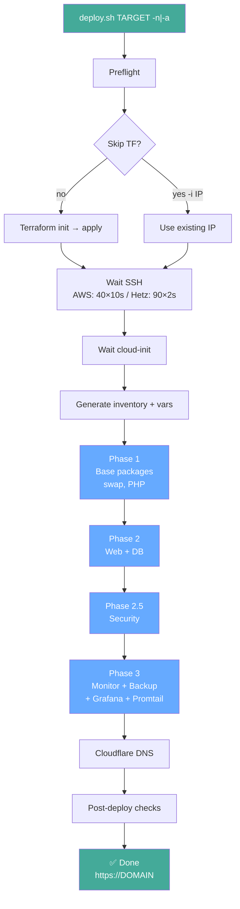
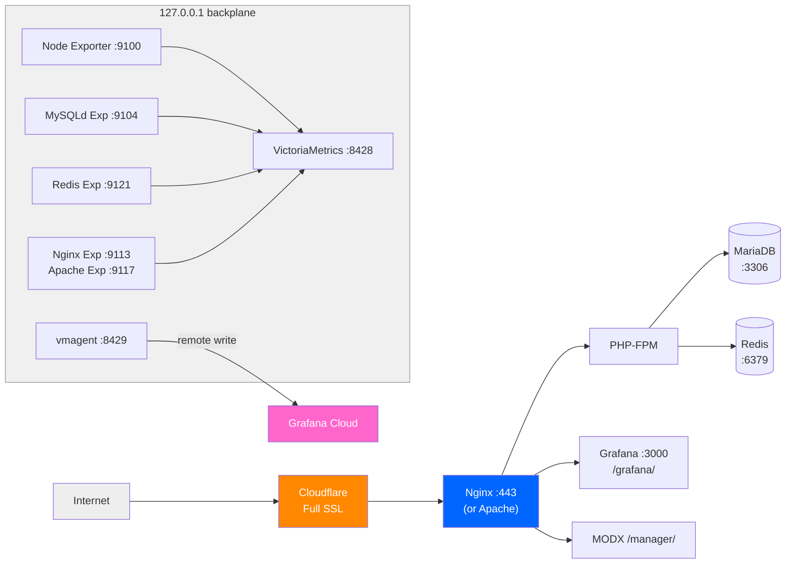

# Architecture

## Deployment Flow



---

## Infrastructure Layers



---

## Secrets Flow

```
secrets/.env (plaintext, gitignored)
   │
   ├─ CI (GitHub Actions)
   │   │
   │   ├─ deploy.yml / test-restore.yml
   │   │   env: block with individual ${{ secrets.* }}
   │   │        → creates secrets/.env from env vars
   │   │        → copies SSH key, vault password, rclone.conf
   │   │
    │   └─ deploy.sh → DEPLOY_VARS_TMP (mktemp, 0600)
    │                  │
    │                  ▼
    │                  ansible-playbook --extra-vars @DEPLOY_VARS_TMP
   │
   └─ Server-side: /home/ubuntu/Scripts/.env (0600)
```

---

## Backup Pipeline

```
smart_backup.sh (hourly via cron)
   │
   ├─ Project: find -newer marker → skip if unchanged
   │            tar.gz → rotate keep 5
   │
   ├─ Database: mysqldump via ~/.my.cnf → gzip → rotate keep 15
   │
   ├─ Push cron_last_run_backup to VictoriaMetrics
   │
   └─ Ping Better Stack heartbeat → uptime.betterstack.com/api/v1/heartbeat

upload_backups_to_gdrive.sh (every hour at :05)
   │
   ├─ rclone copy latest project + db → gdrive-crypt:DreamSeed/backups/{project,db}${ENV}/ (ignore-existing)
   │
   ├─ Prune cloud: 10 project + 100 db → cleanup trash
   │
   └─ Ping Better Stack heartbeat

RESTORE_ALL.sh (interactive or --auto-latest)
   │
   ├─ auto-latest: download from GDrive → local → restore
   ├─ Interactive: menu → choose scope → choose archive
   │
   ├─ Stop web + PHP-FPM
   ├─ Restore project (tar -xzf)
   ├─ Restore DB (gunzip | mysql) + TRUNCATE modx_session
   ├─ Detect rollback via modx_site_content.editedon
   └─ Restart services → health check → Telegram summary
```

---

## Monitoring & Alerting

### Internal Layer (on-server)

```
┌──────────────┐    :8428    ┌─────────────────┐    :8429    ┌───────────────┐
│  Exporters   │─────────────│ VictoriaMetrics │──────────-──│   vmagent     │
│  node_exporter             │ retention: 3mo  │             │ remote write  │
│  nginx/apache_exporter     │ scrape: 15s     │             └───────┬───────┘
│  mysqld_exporter           └────────┬────────┘                     │
│  check_site.sh (every 1m)           │                              │
│  check_services.sh (every 5m)       │                              │
│  smart_backup.sh (heartbeat)        │                              │

└─────────────────────────────────────┘                              │
                                      │                              │
                                      │ Grafana datasource           │ Grafana Cloud
                                      ▼                              ▼
                                 ┌──────────────┐           ┌──────────────────┐
                                 │   Grafana    │           │  Grafana Cloud   │
                                 │  :3000       │           │  (hosted metrics)│
                                  │  5 dashboards│           │  5 community     │
                                                                    │  23 alerts   │           │  dashboards      │
                                  │              │           │  (gnet 1860/7362/│
                                  │              │           │   763/17452/10229)│
                                 └──────┬───────┘           └──────────────────┘
                                        │ Telegram  point
                                        ▼
                                 Telegram (chat_id)
```

### External Layer (cloud — survives server death)

```
Better Stack (cloud)
   │
   ├─ 3 HTTP monitors ──── https://dreamseed.online (3min, 4 regions)
   ├─ 6 cron heartbeats ── backup, gdrive, report-daily, report-weekly, verify-backups, check-services
   └─ Status page ──────── status.dreamseed.online
   │
   └─ Outgoing webhooks
         │
         ├─ Alert (incident started) ──→ Telegram
         └─ Resolve (incident resolved) → Telegram
```

### Alert Rules (Grafana — 23 rules)

| Alert | Severity | Condition | Interval / for |
|-------|----------|-----------|----------------|
| High CPU | warning | >85% 5m | scraped 15s, for: 5m |
| High RAM | warning | >90% 5m | scraped 15s, for: 5m |
| Low Disk Space | warning | <10% free | scraped 15s, for: 5m |
| Swap Thrashing | warning | page-in rate >100/s | scraped 15s, for: 5m |
| MySQL Down | critical | mysql_up == 0 | scraped 15s, for: 2m |
| Nginx/Apache Down | critical | nginx/apache_up == 0 | scraped 15s, for: 2m |
| PHP-FPM Down | critical | php_fpm_up == 0 | pushed 1m, for: 2m |
| Site Down | critical | site_up != 1 | pushed 1m, for: 2m |
| Site Response Time > 5s | warning | site_response > 5s | pushed 1m, for: 5m |
| MODX Core Missing | critical | modx_core_ok == 0 | pushed 1m, for: 5m |
| MODX Cache Not Writable | warning | modx_cache_ok == 0 | pushed 1m, for: 5m |
| VictoriaMetrics Down | critical | victoria_up == 0 | scraped 15s, for: 1m |
| Redis Down | critical | redis_up == 0 | scraped 15s, for: 2m |
| Backup Cron Not Running | warning | >70 min since last run | heartbeat 1h, for: 10m |
| Site Health Check Not Running | warning | >3 min since last run | heartbeat 1m, for: 1m |
| SSL Cert Expiring | info | <7 days remaining | pushed 1m, for: 1h |
| Admin Login Failed | warning | admin_login_ok == 0 | probe 15m, for: 6m |
| MiniShop2 Write Failed | warning | db_write_ok == 0 | probe 15m, for: 6m |
| Database Tables Below Threshold | info | <50 tables in modx_db | pushed 15m, for: 6m |
| Backup Verification Failed | warning | backup_verification_ok == 0 | cron 24h, for: 5m |
| Service Check Not Running | warning | stale >10 min | heartbeat 1m, for: 1m |
| VMAgent Remote Write Failing | critical | vmagent_remote_write_ok == 0 | scraped 15s, for: 2m |
| Cloud Upload Failed | warning | upload_last_success_timestamp >2h | pushed 1h, for: 1h |

### External Monitoring

| Type | Provider | Items | Delivery |
|------|----------|-------|----------|
| Uptime | Better Stack | 3 monitors, 6 heartbeats, status page | Telegram webhooks |
| Real User Monitoring | Grafana Cloud (Faro) | LCP/CLS/INP/TTFB, JS errors, sessions by browser/country | Grafana Cloud dashboard |
| Synthetic Monitoring | Grafana Cloud SM | 4 checks (HTTP main from 3 America probes, MultiHTTP from 2 US probes, Grafana from 2 US probes, SSL from 1 probe) ~15k/mo | Grafana Cloud dashboard |

---

## Security Layers

```
Layer 0 — Edge (Cloudflare):
  Free Managed Ruleset (OWASP Top 10, protocol attacks) — block mode
  Cache Rules (bypass admin, bypass logged-in, 1h TTL)
  DDoS protection (always-on)

Layer 1 — Network:
  Cloudflare proxy (hides origin IP)
  Hetzner Firewall / AWS SG: ports 22, 80, 443 only

Layer 2 — SSH:
  PermitRootLogin no, MaxAuthTries 3, LogLevel VERBOSE
  Disable EC2 Instance Connect (AuthorizedKeysCommand none, 00 prefix wins via sshd first-wins)

Layer 3 — Application:
  fail2ban: modx-admin (POST /connectors/ — 25 retries)
  fail2ban: dreamseed-botsearch (vulnerability scanners — 2 hits)
  fail2ban: dreamseed-bad-request (HTTP 400 — 6 hits)
  MODX core dirs: 0750, config: 0640 root:www-data

Layer 4 — System:
  sysctl hardening (ICMP redirects, martians, core dumps disabled)
  PAM password quality (libpam-passwdqc)
  Password max age: 90 days

Layer 5 — Secrets:
  Ansible Vault at rest
  .env on disk: 0600
  gitleaks on every commit
```

---

## CI/CD Pipeline

```
Trigger            Workflow              Jobs
───────            ────────              ────
Push / PR          CI                    ShellCheck, ansible-lint, actionlint,
                                           Terraform checks (tflint+validate+fmt),
                                          Trivy, gitleaks, pre-commit
                     ────────── 8 parallel ──────────

Manual dispatch    Deploy                Setup → secrets → deploy.sh / destroy
                   Rollback              Get IP → confirm → RESTORE_ALL.sh
                                          → Telegram

Schedule 07:05     Drift Detection       terraform plan -detailed-exitcode
  daily                                  (3 targets: prod-hetz, dev-aws, dev-hetz)

Schedule Mon 10:00 Restore Test          Provision Hetzner → Ansible deploy
   manual                                 → Tests (DB/Web/MODX/cart/SMTP/vmagent/GDrive)
                                           → check_services (timers, fail2ban, exporters)
                                           → Grafana alert rules check (≥23)
                                           → GDrive backup check
                                          → Destroy → Telegram report (P/F/W summary)

Bot events         Renovate              Dependency updates (auto PRs)

Issue comment      ChatOps Deploy        Deploy via chat command
Push / manual      Docs to Wiki          Sync docs/ to GitHub Wiki

```

---

## Project Layout

```
DreamSeed/
├── deploy.sh              # Orchestrator (Terraform → Ansible → checks)
├── lib/                   # Modules: env.sh, helpers.sh, terraform.sh, ansible.sh, gen_vars.py
│   ├── preflight.sh         # Pre-deploy checks (env, SSH key, provider vars)
│   └── helpers.sh          # _cf_zone_id() — shared Cloudflare zone resolver
├── .github/
│   ├── actions/
│   │   ├── setup-terraform/  # Composite: install tf + plugin cache
│   │   ├── setup-ansible/    # Composite: install ansible + galaxy collections
│   │   └── setup-secrets/    # Composite: SSH deploy key, vault password, rclone config
│   ├── scripts/
│   │   └── test-restored-server.sh  # Post-restore verification suite
│   └── workflows/           # 10 workflows (see CI/CD section)
├── scripts/
│   ├── audit_deep.sh        # Full server audit — covers all AUDIT_CHECKLIST sections
│   ├── smart_backup.sh      # Local backup (project, DB, Redis)
│   ├── upload_backups_to_gdrive.sh  # Cloud upload via rclone (gdrive or gdrive-crypt)
│   ├── RESTORE_ALL.sh               # Interactive restore from GDrive (supports encrypted backups)
│   └── verify_backups.sh            # Cloud backup integrity verification
├── terraform/
│   ├── aws/               # EC2 + SG + key_pair + optional EIP
│   ├── hetzner/           # Server + firewall + primary IP
│   ├── grafana/           # Grafana Cloud dashboard provisioning via Terraform
│   ├── cloudflare/        # WAF rulesets, cache rules, rate limiting
├── ansible/
│   ├── playbook-01-base.yml     # System packages, swap
│   ├── playbook-02-web.yml      # Nginx + PHP-FPM + Redis + SSL
│   ├── playbook-03-db.yml       # MariaDB + restore from backup
│   ├── playbook-04-security.yml # Fail2ban, SSH, sysctl hardening
│   ├── playbook-05-monitor.yml  # VictoriaMetrics, exporters, vmagent
│   ├── playbook-06-backup.yml   # Cron jobs, rclone, telegram bot
│   ├── playbook-07-grafana.yml  # Grafana + alerting + dashboards
│   └── playbook-08-promtail.yml # Promtail log shipping (Loki)
│   └── group_vars/all.yml
├── ansible-roles/         # 17 custom roles (including promtail)
├── scripts/               # Backup, restore, Telegram bot, health checks
├── .tflint.hcl            # Terraform linter config (root, drives all providers)
├── secrets/               # gitignored: .env, rclone.conf, tfstate-backup, ssl/
└── .github/workflows/
```
