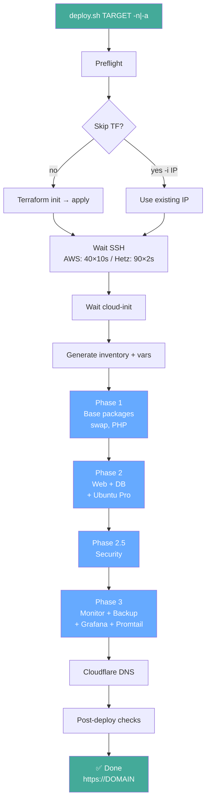
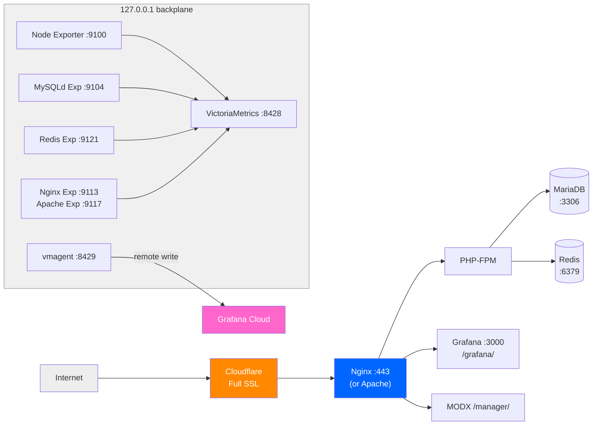

# Architecture

> Interactive map of this codebase: [codemap.html](../codemap/codemap.html). This page is the static prose version; the map is the machine-generated visual layer (nodes, weighted edges, flows). Regenerate it with the codemap generator, never hand-edit the outputs.
>
> 🗓 **Last updated:** 2026-08-18

## Table of Contents

- [Deployment Flow](#deployment-flow)
- [Infrastructure Layers](#infrastructure-layers)
- [Secrets Flow](#secrets-flow)
- [Backup Pipeline](#backup-pipeline)
- [Monitoring & Alerting](#monitoring--alerting)
- [Security Layers](#security-layers)
- [CI/CD Pipeline](#cicd-pipeline)
- [Project Layout](#project-layout)

## Deployment Flow



---

## Infrastructure Layers



---

## Secrets Flow

```
secrets/.env (ansible-vault AES256 encrypted, gitignored)
   │
   ├─ CI (GitHub Actions)
   │   │
   │   ├─ deploy.yml / test-restore.yml
   │   │   env: block with individual ${{ secrets.* }}
   │   │        → creates secrets/.env from env vars
   │   │        → copies SSH key, vault password, rclone.conf
   │   │
   │   └─ deploy.sh → DEPLOY_VARS_TMP (mktemp, 0600)
   │                  │
   │                  ▼
   │                  ansible-playbook --extra-vars @DEPLOY_VARS_TMP
   │
   └─ Server-side: /home/ubuntu/Scripts/.env (0600)
```

---

## Backup Pipeline

```
smart_backup.sh (hourly via cron)
   │
   ├─ Project: find -newer marker → skip if unchanged
   │            tar.gz → rotate keep 5
   │
   ├─ Database: mysqldump via ~/.my.cnf → gzip → rotate keep 15
   │
   ├─ Push cron_last_run_backup to VictoriaMetrics
   │
   └─ Ping Better Stack heartbeat → uptime.betterstack.com/api/v1/heartbeat

upload_backups_to_gdrive.sh (every hour at :05)
   │
   ├─ rclone copy latest project + db → gdrive-crypt:DreamSeed/backups/{project,db}${ENV}/ (ignore-existing)
   │
   ├─ Prune cloud: 10 project + 100 db → cleanup trash
   │
   └─ Ping Better Stack heartbeat

RESTORE_ALL.sh (interactive or --auto-latest)
   │
   ├─ auto-latest: download from GDrive → local → restore
   ├─ Interactive: menu → choose scope → choose archive
   │
   ├─ Stop web + PHP-FPM
   ├─ Restore project (tar -xzf)
   ├─ Restore DB (gunzip | mysql) + TRUNCATE modx_session
   ├─ Detect rollback via modx_site_content.editedon
   └─ Restart services → health check → Telegram summary
```

---

## Monitoring & Alerting

### Internal Layer (on-server)

```
┌──────────────────────────────┐  :8428     ┌──────────────────┐  :8429     ┌────────────────┐
│  Exporters                   │───────────▶│  VictoriaMetrics │───────────▶│  vmagent       │
│  node_exporter               │            │  retention: 3mo  │            │  remote write  │
│  nginx/apache_exporter       │            │  scrape: 15s     │            └───────┬────────┘
│  mysqld_exporter             │            └────────┬─────────┘                    │
│  check_site.sh (every 1m)    │                     │                              │
│  check_services.sh (every 5m)│                     │                              │
│  smart_backup.sh (heartbeat) │                     │                              │
└──────────────────────────────┘                     │                              │
                                                     │                              │
                                                     │ Grafana datasource           │ Grafana Cloud
                                                     ▼                              ▼
                                              ┌─────────────────┐     ┌─────────────────────┐
                                              │   Grafana       │     │  Grafana Cloud      │
                                              │  :3000          │     │  hosted metrics     │
                                              │  27 alerts      │     │  5 community        │
                                              │ 6/5 dashboards  │     │  (gnet 1860/...)    │
                                              └────────┬────────┘     └─────────────────────┘
                                                       │ Telegram point
                                                       ▼
                                              Telegram (chat_id)
```

### External Layer (cloud — survives server death)

```
Better Stack (cloud)
   │
   ├─ 3 HTTP monitors ── main site + /manager/ + /grafana (3min, 4 regions: EU/US/Asia/AU)
   ├─ 6 cron heartbeats ── backup, gdrive, report-daily, report-weekly, verify-backups, check-services
   └─ Status page ──────── status.dreamseed.online
   │
   └─ Outgoing webhooks
         │
         ├─ Alert (incident started) ──→ Telegram
         └─ Resolve (incident resolved) → Telegram
```

### Alert Rules (Grafana — 27 rules)

> Two classes:
>
> - **Value alerts** (`noDataState=OK`): fire only when the probe reports a real
>   failure value. A dead producer (check_site.sh / check_services.sh) does NOT
>   false-fire them — that is the canaries' job.
> - **Canaries** (`noDataState=Alerting`, marked 🔔): fire and keep firing when
>   the producer itself dies (check-site-cron, check-services-cron). They are the
>   authoritative "checker is dead" signal; correlated value alerts then read as
>   "service broken" only when the checker is alive.
>
> Everything below runs inside the local VM (single node per server). Exporter
> metrics are scraped by VM (15s); check_site.sh pushes every 1m; check_services.sh
> every 5m. Better Stack (external) covers the public/edge view — see below.

| Alert | Severity | Condition | Interval / for |
|-------|----------|-----------|----------------|
| High CPU | warning | >85% 5m | node_exporter 15s, for: 5m |
| High RAM | warning | >90% 5m | node_exporter 15s, for: 5m |
| Low Disk Space | warning | <10% free | node_exporter 15s, for: 5m |
| Swap Thrashing | warning | page-in rate >100/s | node_exporter 15s, for: 5m |
| MySQL Down | critical | mysql_up == 0 | mysqld_exporter 15s, for: 2m |
| Nginx/Apache Down | critical | nginx/apache_up == 0 | exporter 15s, for: 2m |
| PHP-FPM Down | critical | php_fpm_up == 0 (value only) | check_site 1m, for: 2m |
| Site Down | critical | site_up == 0 (value only, localhost probe) | check_site 1m, for: 2m |
| Site Response Time > 5s | warning | site_response > 5s (localhost probe) | check_site 1m, for: 5m |
| MODX Core Missing | critical | modx_core_ok == 0 | check_site 1m, for: 5m |
| MODX Cache Not Writable | warning | modx_cache_ok == 0 | check_site 1m, for: 5m |
| VictoriaMetrics Down | critical | victoria_up == 0, or VM query error | check_site 1m, for: 1m |
| Redis Down | critical | redis_up == 0 | redis_exporter 15s, for: 2m |
| Backup Cron Not Running | warning | >90 min since smart_backup ran (window 1d) | smart_backup 1h, for: 10m |
| Site Health Check Not Running 🔔 | warning | check_site_last_run stale >3 min | check_site 1m, for: 1m |
| SSL Cert Expiring | info | <7 days remaining | check_site 1m, for: 1h |
| Admin Login Failed | warning | admin_login_ok == 0 (localhost probe) | check_site 15m, for: 15m |
| MiniShop2 Write Failed | warning | db_write_ok == 0 | check_site 15m, for: 6m |
| Database Tables Below Threshold | info | <50 tables in modx_db | check_site 15m, for: 6m |
| Backup Verification Failed | warning | min(local,cloud backup_verification_ok) == 0 | verify_backups 24h, for: 5m |
| Service Check Not Running 🔔 | warning | check_services_last_run stale >10 min (window 2h) | check_services 5m, for: 10m |
| Fail2ban Down | warning | fail2ban_up == 0 | check_services 5m, for: 10m |
| Promtail Down | warning | promtail_up == 0 | check_services 5m, for: 10m |
| Node Exporter Down | warning | service_status{node_exporter} == 0 | check_services 5m, for: 10m |
| Telegram Bot Down | warning | service_status{telegram-bot} == 0 | check_services 5m, for: 10m |
| VMAgent Remote Write Failing | critical | vmagent_remote_write_ok == 0 | check_services 5m, for: 10m |
| Cloud Upload Failed | warning | upload_last_success_timestamp >2h | upload script 1h, for: 5m |

### External Monitoring

| Type | Provider | Items | Delivery |
|------|----------|-------|----------|
| Uptime | Better Stack | 3 monitors, 6 heartbeats, status page | Telegram webhooks |
| Real User Monitoring | Grafana Cloud (Faro) | LCP/CLS/INP/TTFB, JS errors, sessions by browser/country | Grafana Cloud dashboard |
| Synthetic Monitoring | Grafana Cloud SM | 4 checks (HTTP main from 5 global probes, MultiHTTP from 2 US probes, Grafana from 2 US probes, SSL from 3 global probes) ~22k/mo | Grafana Cloud dashboard |

---

## Security Layers

```
Layer 0 — Edge (Cloudflare):
  Free Managed Ruleset (OWASP Top 10, protocol attacks) — block mode
  Cache Rules (bypass admin, bypass logged-in, 1h TTL)
  DDoS protection (always-on)

Layer 1 — Network:
  Cloudflare proxy (hides origin IP)
  Hetzner Firewall / AWS SG: port 22 (world) + 80/443 (Cloudflare edge ranges only)

Layer 2 — SSH:
  PermitRootLogin no, MaxAuthTries 3, LogLevel VERBOSE
  Disable EC2 Instance Connect (AuthorizedKeysCommand none, 00 prefix wins via sshd first-wins)

Layer 3 — Application:
  fail2ban: modx-admin (POST /connectors/ — 25 retries) → bans at Cloudflare edge
  fail2ban: dreamseed-botsearch (vulnerability scanners — 2 hits) → edge ban 12h
  fail2ban: dreamseed-bad-request (HTTP 400 — 6 hits) → edge ban 1h
  MODX core dirs: 0750, config: 0640 root:www-data

Layer 4 — System:
  sysctl hardening (ICMP redirects, martians, core dumps disabled)
  PAM password quality (libpam-passwdqc)
  Password max age: 90 days

Layer 5 — Secrets:
  Ansible Vault at rest
  .env on disk: 0600
  gitleaks on every commit
```

---

## CI/CD Pipeline

```
Trigger            Workflow              Jobs
───────            ────────              ────
Push / PR          CI                    11 jobs (8 required for merge):
                                           ShellCheck, ansible-lint, actionlint,
                                           Terraform checks (tflint+validate+fmt),
                                           Checkov, Trivy, gitleaks, yamllint,
                                           zizmor, pre-commit, Deploy Check
                     ────────── 8 required ──────────

Manual dispatch    Deploy                Setup → secrets → deploy.sh / destroy
                   Rollback              Get IP → confirm → RESTORE_ALL.sh
                                          → Telegram

Schedule 07:05     Drift Detection       terraform plan -detailed-exitcode
  daily                                  (5 targets: prod-hetz, dev-aws,
                                           dev-hetz, cloudflare, cloudflare-prod)

Schedule Mon 10:00 Restore Test          Provision Hetzner → Ansible deploy (target `test`)
   manual                                 → Restore paths: local + cloud (GDrive)
                                            → Tests (DB/Web/MODX/cart/vmagent/GDrive/
                                              Redis/Promtail) — P/F/W summary
                                            → GDrive backup check
                                          → Destroy → job summary

Bot events         Renovate              Dependency updates (auto PRs)

Issue comment      ChatOps Deploy        Deploy via chat command
Push / manual      Docs                  Pages site (code map) + wiki sync

```

---

## Project Layout

The canonical directory tree lives in the [repository README](https://github.com/W1ckedS1ck/DreamSeed#-project-layout) — kept in sync with the code rather than duplicated here.

For a machine-verified, clickable version of the same structure (modules, edges, flows), use the [interactive code map](../codemap/codemap.html) or the [published site](https://w1ckeds1ck.github.io/DreamSeed/).
